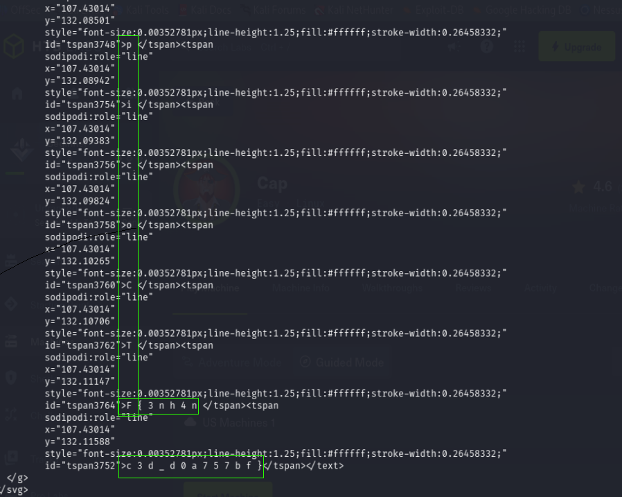

# Enhance!

**Platform:** picoCTF / CyLab 2022
**Category:** Forensics
**Difficulty:** Medium
**Author:** LT 'syreal' Jones
**Challenge Link:** [Enhance!](https://learn.cylabacademy.org/library/265?page=1&search=enh)

---

## Challenge Description

> Download this image file and find the flag.

### Files Provided

* `drawing.flag.svg`

---

# Objective

* Analyze the provided SVG image.
* Search for hidden information within the file.
* Recover the flag.

---

# Initial Analysis

The challenge provides an SVG image:

```text
drawing.flag.svg
```

Since many forensic challenges hide information inside metadata, the first step was to inspect the file using `exiftool`.

---

# Solution

## Step 1 - Examine the Metadata

Inspect the SVG metadata:

```bash
exiftool drawing.flag.svg
```

The output only contains standard SVG metadata such as:

* Image dimensions
* SVG version
* XML namespace
* Document information

No suspicious metadata fields or hidden strings were present.

Therefore, another inspection technique was required.

---

## Step 2 - Inspect Readable Strings

SVG files are XML-based text files rather than binary images.

This makes the `strings` utility useful for inspecting their contents.

```bash
strings drawing.flag.svg
```

The output appears normal at first glance.

However, careful inspection reveals that individual characters of the flag are embedded inside separate XML `<tspan>` elements.



Each highlighted line contributes one or more characters to the flag.

By reading these characters in order and removing the spaces, the complete flag can be reconstructed.

---

# Flag

```text
picoCTF{REDACTED}
```

---

# Why the Attack Works

Unlike JPEG or PNG images, SVG files are plain-text XML documents.

This means:

* Image contents can be inspected using text-processing utilities.
* Hidden data may exist directly inside the XML structure.
* The `strings` command can reveal embedded text without needing specialized forensic tools.

In this challenge, the flag was intentionally split across multiple `<tspan>` elements within the SVG source code, making it invisible during normal viewing but easy to recover by inspecting the file contents.

---

# Key Takeaways

* SVG images are XML text files, not binary image formats.
* `exiftool` is useful for checking metadata but may not always reveal hidden information.
* The `strings` utility is valuable for inspecting readable text inside files.
* When metadata does not contain the answer, inspect the file contents directly.
* Understanding the underlying file format often leads to the intended solution.

---

# Tools Used

* exiftool
* strings
* Linux Terminal
