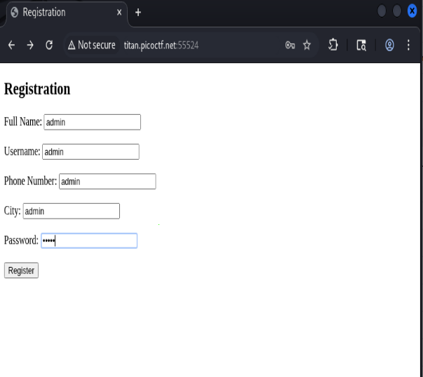
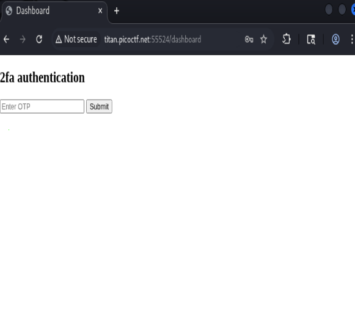
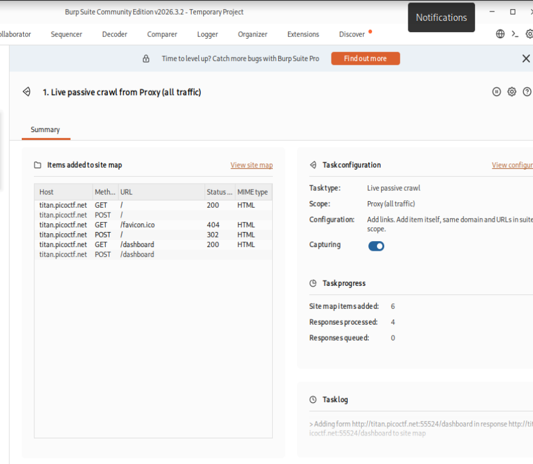
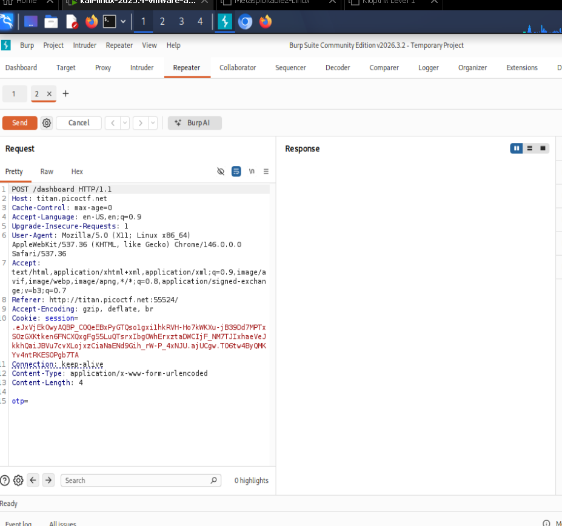
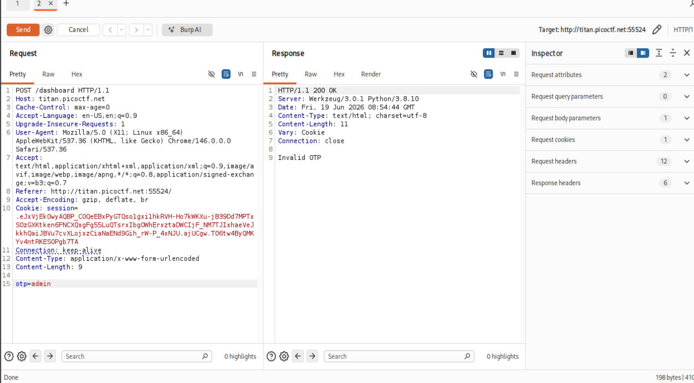
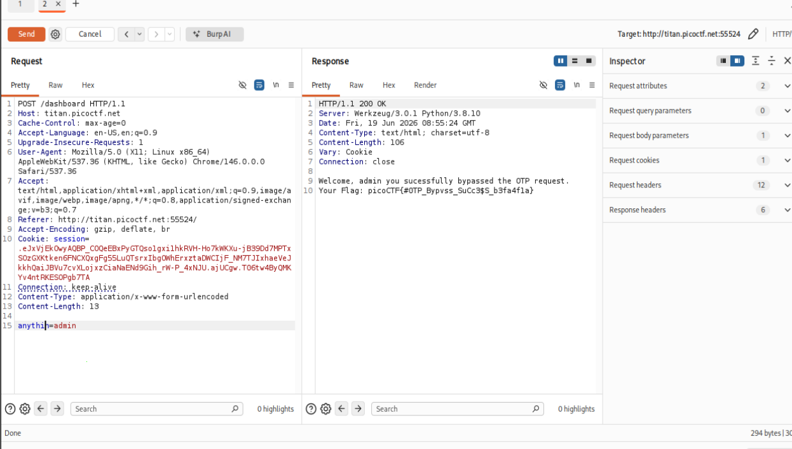

# IntroToBurp

**Platform:** picoCTF / CyLab 2024
**Category:** Web Exploitation
**Difficulty:** Easy
**Author:** Nana Ama Atombo-Sackey & Sabine Gisagara
**Challenge Link:** [IntroToBurp](https://learn.cylabacademy.org/library/419?page=1&search=intro)

---

## Challenge Description

> Try here to find the flag.

### Hints

1. Try using Burp Suite to intercept the request to capture the flag.
2. Try mangling the request; maybe the server-side code doesn't handle malformed requests very well.

---

# Objective

* Intercept the application's requests using Burp Suite.
* Analyze the OTP verification request.
* Manipulate the request to bypass the OTP validation.
* Retrieve the flag.

---

# Solution

## Step 1 - Register an Account

Launch the challenge instance and open the provided registration page.

Since the account details are not important for this challenge, arbitrary values can be entered into the registration form.



---

## Step 2 - Reach the OTP Verification Page

After submitting the registration form, the application redirects to a page requesting a One-Time Password (OTP).



---

## Step 3 - Intercept the Request

Open **Burp Suite** and launch the embedded browser from the **Proxy** tab.

Navigate through the application until the OTP page is reached.

The Proxy history shows all HTTP requests made by the browser.

Locate the latest **POST** request responsible for OTP verification.



---

## Step 4 - Send the Request to Repeater

Right-click the OTP verification request and select:

```text
Send to Repeater
```

This allows the request to be modified and resent multiple times.



The request contains an `otp` parameter near the end.

---

## Step 5 - Test the OTP Validation

Modify the `otp` value to an arbitrary string and resend the request.

For example:

```text
otp=admin
```

The server responds with:

```text
Invalid OTP
```

indicating that the application validates the supplied OTP.



---

## Step 6 - Remove the OTP Parameter

Instead of modifying the OTP value, completely remove the `otp` parameter from the request and resend it.

The server incorrectly processes the malformed request and bypasses the OTP verification, revealing the flag.



---

# Flag

```text
picoCTF{REDACTED}
```

---

# Why the Attack Works

The application fails to properly validate the incoming request on the server side.

Instead of rejecting requests that are missing the required `otp` parameter, the server continues processing the request as though authentication had succeeded.

This is an example of improper input validation and insecure server-side logic. Security-critical parameters should always be verified before granting access.

---

# Key Takeaways

* Burp Suite is an essential tool for intercepting and modifying HTTP requests.
* Client-side controls should never be trusted for authentication.
* Removing or modifying HTTP parameters can reveal server-side validation flaws.
* Authentication mechanisms should validate that all required parameters are present and correct.
* Security decisions must always be enforced on the server.

---

# Tools Used

* Burp Suite
* Web Browser
