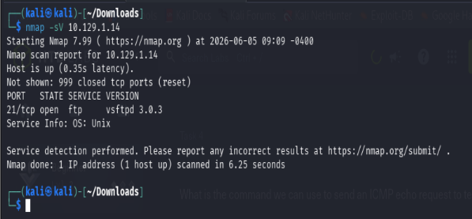
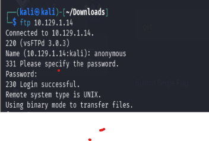
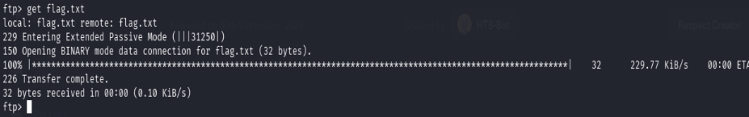
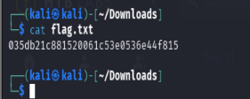

# Fawn

**Platform:** Hack The Box
**Difficulty:** Very Easy
**Completed Date:** 2026-06-05

---

## 📋 Summary

Fawn is a beginner-friendly Hack The Box Starting Point machine that introduces FTP enumeration and authentication. The objective is to identify the exposed service, gain access to the FTP server, and retrieve the flag.

---

## 🎯 Objectives

* [x] Identify running services
* [x] Gain access to the target
* [x] Retrieve the flag

---

## 🔍 Reconnaissance

An Nmap service version scan was performed against the target.

### Nmap Scan

```bash
nmap -sV <target-ip>
```

### Findings

| Port | Service | Version      |
| ---- | ------- | ------------ |
| 21   | FTP     | vsftpd 3.0.3 |

The scan revealed that an FTP service was running on port 21.

### Screenshot



---

## 🕵️ Enumeration

Since FTP was the only exposed service, further investigation focused on testing authentication methods.

An anonymous login attempt was made using the FTP client.

### Commands Used

```bash
ftp <target-ip>
```

Username:

```text
anonymous
```

The server accepted anonymous authentication, granting access to the FTP service without requiring valid user credentials.

### Screenshot



---

## 🚀 Exploitation

After successfully authenticating to the FTP server, the available files were listed and the flag file was identified.

### Commands Used

```bash
ls
get flag.txt
```

The `get` command was used to download the flag file from the server to the local machine.

### Screenshot



---

## 🏁 Flag Retrieval

Once the file was downloaded, it was viewed locally to obtain the flag.

### Commands Used

```bash
cat flag.txt
```

### Screenshot



---

## 🛠️ Tools Used

* Nmap
* FTP Client
* Linux Command Line

---

## 📚 Lessons Learned

* FTP services may permit anonymous authentication if misconfigured.
* Enumeration is the most important step before attempting exploitation.
* Publicly accessible services can expose sensitive information when proper access controls are not enforced.
* Even simple misconfigurations can lead to unauthorized access.

---

## 🔑 Key Takeaways

* Discovered an FTP service running on port 21.
* Successfully authenticated using anonymous access.
* Downloaded and viewed the flag file.
* Practiced basic service enumeration and FTP interaction.
* Gained hands-on experience with common penetration testing workflow.
